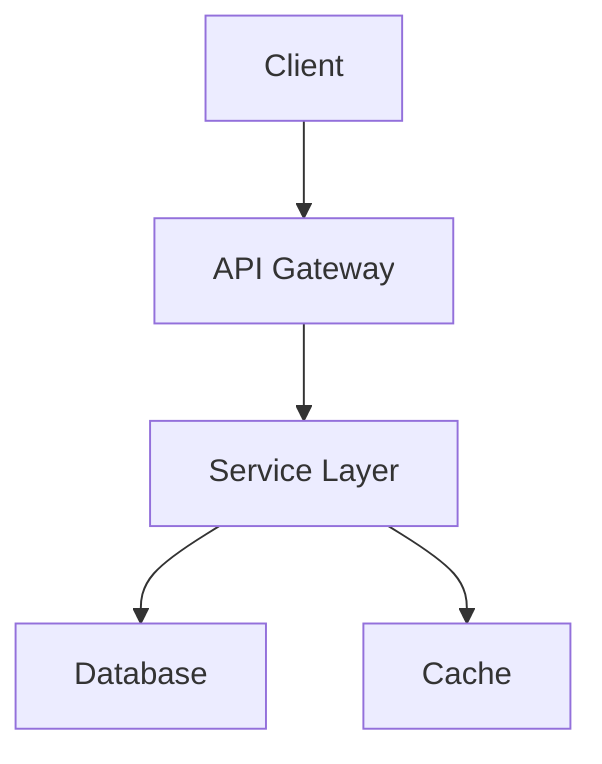
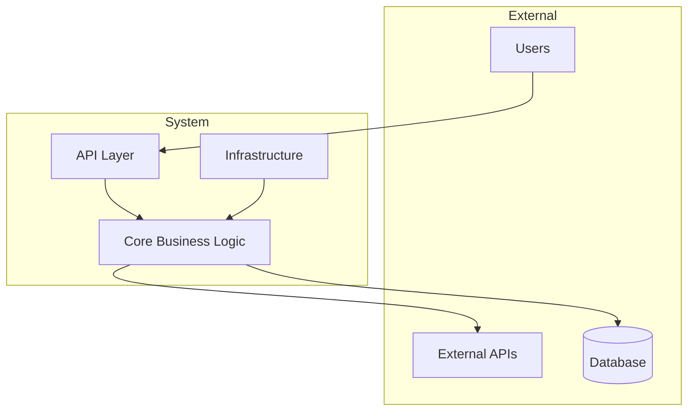
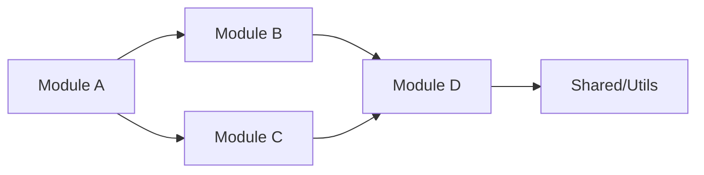
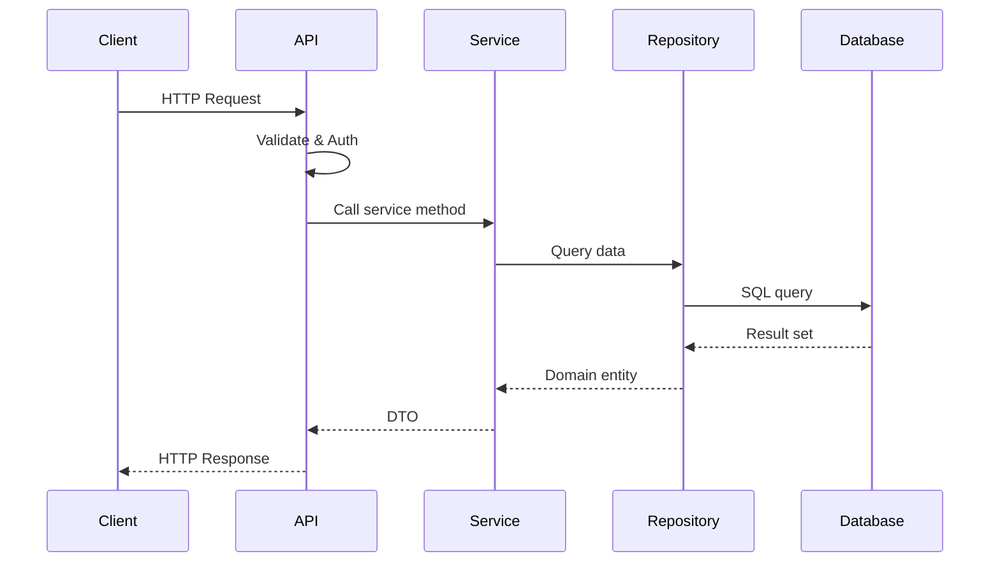
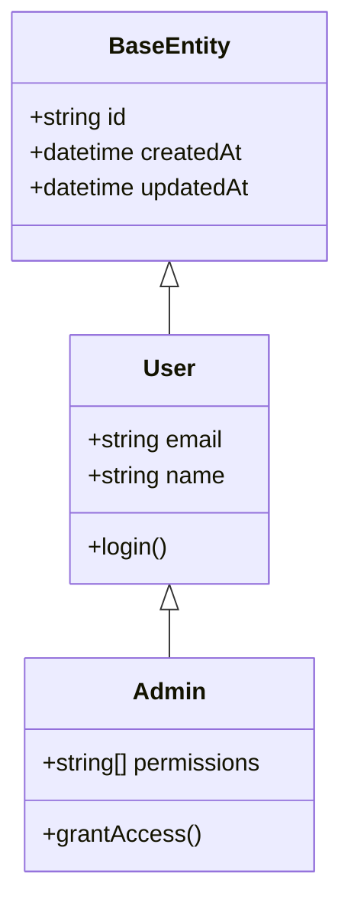
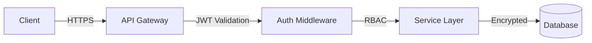
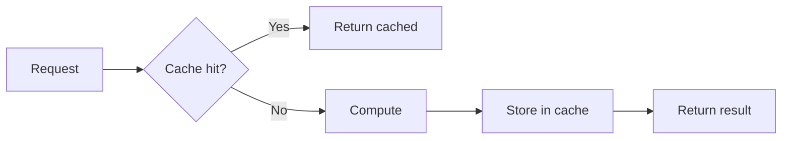

# Project Documentation Templates

Templates for all project-level documentation artifacts. Fill every section with specific, concrete content based on the actual codebase. Never use generic filler text.

---

## 1. README.md Template

```markdown
# [Project Name]

[Badges: CI, coverage, license, version]

> [One-sentence project description]

## Table of Contents

- [Features](#features)
- [Quick Start](#quick-start)
- [Installation](#installation)
- [Usage](#usage)
- [Configuration](#configuration)
- [Architecture](#architecture)
- [API Reference](#api-reference)
- [Development](#development)
- [Testing](#testing)
- [Deployment](#deployment)
- [Contributing](#contributing)
- [License](#license)

## Features

- [Feature 1]: [one-line description]
- [Feature 2]: [one-line description]
- [Feature 3]: [one-line description]

## Quick Start

[Prerequisites]

```bash
[installation commands]
```

```bash
[minimal usage example]
```

## Installation

### From package manager

```bash
[package manager install command]
```

### From source

```bash
git clone [repo-url]
cd [project]
[build/install commands]
```

### Requirements

| Dependency | Version | Purpose |
|-----------|---------|---------|
| [dep] | [version] | [why needed] |

## Usage

### Basic usage

```[lang]
[basic usage example]
```

### Advanced usage

```[lang]
[advanced usage example]
```

## Configuration

| Variable | Type | Default | Description |
|----------|------|---------|-------------|
| [VAR_NAME] | [type] | [default] | [description] |

Configuration file location: `[path]`

## Architecture



[2-3 sentence architecture overview]

See [docs/architecture.md](docs/architecture.md) for full details.

## API Reference

| Endpoint / Module | Description |
|-------------------|-------------|
| [endpoint/module] | [description] |

See [docs/api-reference.md](docs/api-reference.md) for full API documentation.

## Development

### Setup

```bash
[dev setup commands]
```

### Available scripts

| Command | Description |
|---------|-------------|
| `[command]` | [description] |

### Project structure

```
project-root/
├── src/            # Source code
│   ├── [module]/   # [module purpose]
│   └── [module]/   # [module purpose]
├── tests/          # Test files
├── docs/           # Documentation
├── config/         # Configuration
└── scripts/        # Build/deploy scripts
```

## Testing

```bash
[run tests command]
```

| Test suite | Command | Coverage target |
|-----------|---------|-----------------|
| Unit | `[cmd]` | [%] |
| Integration | `[cmd]` | [%] |
| E2E | `[cmd]` | [%] |

## Deployment

### Environment variables

| Variable | Required | Description |
|----------|----------|-------------|
| [VAR] | Yes/No | [description] |

### Deploy steps

1. [Step 1]
2. [Step 2]
3. [Step 3]

## Contributing

1. Fork the repository
2. Create a feature branch (`git checkout -b feature/name`)
3. Make changes and add tests
4. Run linting and tests (`[commands]`)
5. Commit with conventional commit messages
6. Push and open a Pull Request

### Code style

- [Style guide reference]
- [Linter configuration]

## License

[License type] - see [LICENSE](LICENSE) for details.
```

---

## 2. API Reference Template

```markdown
# API Reference

> Auto-generated from source code docblocks. Last updated: YYYY-MM-DD.

## Table of Contents

- [Overview](#overview)
- [Modules](#modules)
  - [Module Name](#module-name)
- [Types](#types)
- [Errors](#errors)
- [Constants](#constants)

## Overview

[Brief description of the API surface, entry points, and usage patterns.]

### Authentication

[If applicable: how to authenticate with the API]

### Rate limiting

[If applicable: rate limit details]

---

## Modules

### [Module Name]

> [Module description]

**Source:** `path/to/module`

#### Functions

##### `functionName(param1: Type, param2: Type): ReturnType`

[Description from docblock]

**Parameters:**

| Name | Type | Required | Default | Description |
|------|------|----------|---------|-------------|
| param1 | Type | Yes | - | [description] |
| param2 | Type | No | default | [description] |

**Returns:** `ReturnType` - [description]

**Throws:**

| Error | Condition |
|-------|-----------|
| ErrorType | [when thrown] |

**Example:**

```[lang]
[example from docblock]
```

---

## Types

### `TypeName`

[Description]

```[lang]
type TypeName = {
  field1: string;   // [description]
  field2: number;   // [description]
}
```

| Field | Type | Description |
|-------|------|-------------|
| field1 | string | [description] |
| field2 | number | [description] |

---

## Errors

### `ErrorName`

> [When this error occurs]

**Code:** `[error code]`
**HTTP Status:** `[status if applicable]`

**Properties:**

| Property | Type | Description |
|----------|------|-------------|
| message | string | [description] |
| code | string | [description] |

---

## Constants

| Name | Value | Description |
|------|-------|-------------|
| CONST_NAME | value | [description] |
```

---

## 3. Architecture Overview Template

```markdown
# Architecture Overview

> System design and structure for [Project Name]. Last updated: YYYY-MM-DD.

## Table of Contents

- [System Context](#system-context)
- [Module Structure](#module-structure)
- [Data Flow](#data-flow)
- [Entity Hierarchy](#entity-hierarchy)
- [Technology Stack](#technology-stack)
- [Directory Structure](#directory-structure)
- [Design Decisions](#design-decisions)
- [Security Architecture](#security-architecture)
- [Performance Considerations](#performance-considerations)

---

## System Context



[Description of system boundaries, actors, and external dependencies.]

---

## Module Structure



| Module | Responsibility | Dependencies |
|--------|---------------|--------------|
| [Module A] | [what it does] | [depends on] |
| [Module B] | [what it does] | [depends on] |

### Module details

#### [Module A]

- **Purpose:** [one sentence]
- **Public API:** [list of exports]
- **Internal components:** [list of internal parts]
- **Dependencies:** [what it imports from other modules]

---

## Data Flow



[Description of the primary data flows through the system.]

### Critical flows

1. **[Flow name]:** [description with sequence reference]
2. **[Flow name]:** [description with sequence reference]

---

## Entity Hierarchy



| Entity | Table/Collection | Key Relationships |
|--------|-----------------|-------------------|
| [Entity] | [table name] | [relationships] |

---

## Technology Stack

| Layer | Technology | Version | Purpose |
|-------|-----------|---------|---------|
| Language | [lang] | [version] | [why chosen] |
| Framework | [fw] | [version] | [why chosen] |
| Database | [db] | [version] | [why chosen] |
| Cache | [cache] | [version] | [why chosen] |
| Message Queue | [mq] | [version] | [why chosen] |

---

## Directory Structure

```
project-root/
├── src/
│   ├── [layer]/          # [purpose]
│   │   ├── [module]/     # [purpose]
│   │   └── [module]/     # [purpose]
│   ├── shared/           # Cross-cutting concerns
│   │   ├── utils/        # Utility functions
│   │   ├── types/        # Shared type definitions
│   │   └── constants/    # Application constants
│   └── config/           # Configuration loading
├── tests/
│   ├── unit/             # Unit tests
│   ├── integration/      # Integration tests
│   └── e2e/              # End-to-end tests
├── docs/                 # Documentation
├── scripts/              # Build and deploy scripts
├── config/               # Configuration files
└── [other]/              # [purpose]
```

| Directory | Purpose | Owner |
|-----------|---------|-------|
| `src/[x]` | [purpose] | [team/person] |

---

## Design Decisions

### Decision 1: [Title]

- **Context:** [why this decision was needed]
- **Options considered:**
  1. [Option A] - [pros/cons]
  2. [Option B] - [pros/cons]
- **Decision:** [what was chosen]
- **Rationale:** [why this option]
- **Consequences:** [trade-offs accepted]

---

## Security Architecture



| Concern | Implementation | Notes |
|---------|---------------|-------|
| Authentication | [method] | [details] |
| Authorization | [method] | [details] |
| Data encryption | [method] | [details] |
| Input validation | [method] | [details] |
| Secrets management | [method] | [details] |

---

## Performance Considerations

| Bottleneck | Mitigation | Target |
|-----------|-----------|--------|
| [bottleneck] | [mitigation] | [metric] |

### Caching strategy



[Cache layers, TTLs, invalidation strategy.]
```

---

## 4. CHANGELOG.md Template

```markdown
# Changelog

All notable changes to this project will be documented in this file.

The format is based on [Keep a Changelog](https://keepachangelog.com/en/1.1.0/),
and this project adheres to [Semantic Versioning](https://semver.org/spec/v2.0.0.html).

## [Unreleased]

### Added
- [New feature description] ([PR/commit link])

### Changed
- [Changed behavior description] ([PR/commit link])

### Deprecated
- [Deprecated feature description] ([PR/commit link])

### Removed
- [Removed feature description] ([PR/commit link])

### Fixed
- [Bug fix description] ([PR/commit link])

### Security
- [Security fix description] ([PR/commit link])

---

## [1.2.0] - 2024-01-15

### Added
- [Feature] - [description] ([#PR])
- [Feature] - [description] ([#PR])

### Changed
- [Change] - [description] ([#PR])

### Fixed
- [Fix] - [description] ([#PR])

---

## [1.1.0] - 2024-01-01

### Added
- [Feature] - [description] ([#PR])

### Fixed
- [Fix] - [description] ([#PR])

---

## [1.0.0] - 2023-12-01

### Added
- Initial release
- [Core feature 1]
- [Core feature 2]

[Unreleased]: https://github.com/[org]/[repo]/compare/v1.2.0...HEAD
[1.2.0]: https://github.com/[org]/[repo]/compare/v1.1.0...v1.2.0
[1.1.0]: https://github.com/[org]/[repo]/compare/v1.0.0...v1.1.0
[1.0.0]: https://github.com/[org]/[repo]/releases/tag/v1.0.0
```

---

## Generation rules

1. **Never use placeholder text.** Every section must contain real content derived from the codebase.
2. **Mermaid diagrams must be valid.** Test syntax mentally before writing. Use `graph TD`, `graph LR`, `sequenceDiagram`, `classDiagram` as appropriate.
3. **Tables must be complete.** Every row must have data. No "TBD" or "TODO" cells.
4. **Cross-reference consistently.** Use relative links between docs: `[API Reference](docs/api-reference.md)`.
5. **Date all artifacts.** Use ISO 8601 dates (YYYY-MM-DD).
6. **Keep CHANGELOG append-only.** Never remove entries. Move items from `[Unreleased]` to a versioned section on release.
