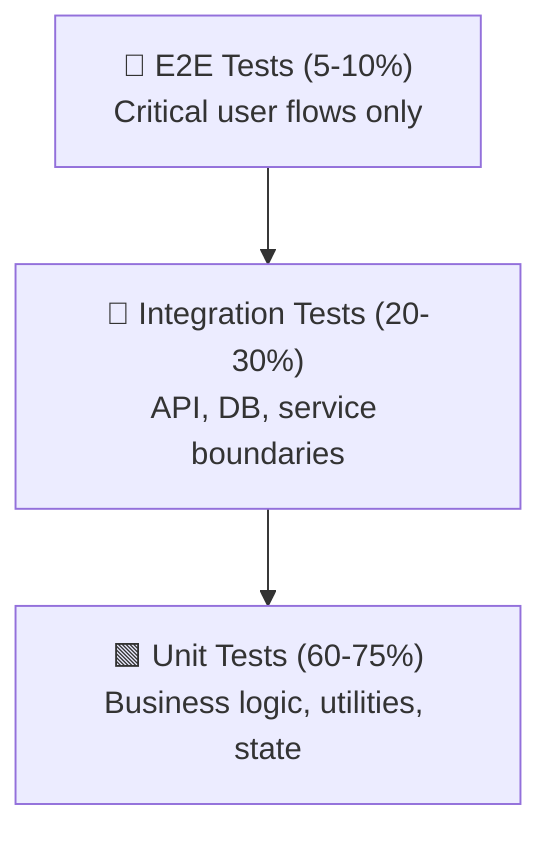
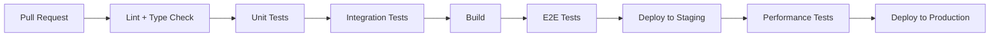

# Test Strategy: [Feature / Product Name]

**Version:** 1.0
**Status:** DRAFT | APPROVED | IN PROGRESS | COMPLETE
**Created:** YYYY-MM-DD
**Author:** [Name / Team]
**Reviewed By:** [Name / Team]

---

## 1. Executive Summary

> 3–6 sentence high-signal summary. What does this strategy cover?
> What is at stake? What does success look like?

**Scope:** [feature / module / entire product]
**Risk Level:** Low | Medium | High | Critical
**Primary Goal:** [e.g., "Ensure zero data-loss bugs in the payment flow before launch"]

---

## 2. Test Pyramid

The test pyramid defines the distribution of testing effort across layers. More tests at the bottom (fast, cheap, isolated), fewer at the top (slow, expensive, realistic).



| Layer | % of Total Tests | Speed | Confidence | Maintenance Cost |
|---|---|---|---|---|
| Unit | 60-75% | Fast (< 100ms each) | Low (isolated) | Low |
| Integration | 20-30% | Medium (< 2s each) | Medium (real deps) | Medium |
| E2E | 5-10% | Slow (> 5s each) | High (real user) | High |

**Rationale:** [Why this distribution for this specific project. Adjust percentages based on risk profile.]

---

## 3. Unit Testing

### 3.1 What to test

- Business logic (calculations, transformations, validations)
- State management (store actions, reducers, computed properties)
- Utility functions (helpers, formatters, parsers)
- Error handling (try/catch, error boundaries, fallback paths)

### 3.2 What NOT to test

- Framework internals (don't test that React renders a div)
- Third-party library behavior (mock at the boundary)
- Implementation details (test behavior, not internal state)

### 3.3 Patterns

**Arrange-Act-Assert (AAA):**
```
// Arrange: set up preconditions
// Act: execute the behavior
// Assert: verify the outcome
```

**Naming convention:**
```
describe('[ModuleName]')
  it('should [expected behavior] when [condition]')
```

### 3.4 Coverage targets

| Module / Area | Target | Rationale |
|---|---|---|
| Core business logic | 90%+ | Highest risk, most complex |
| Utilities / helpers | 80%+ | Reused everywhere |
| UI components | 60%+ | Test logic, not markup |
| Config / constants | 50%+ | Low risk, simple |

---

## 4. Integration Testing

### 4.1 What to test

- API endpoints (request → response, including error cases)
- Database operations (CRUD, transactions, migrations)
- Service-to-service communication (message queues, HTTP calls)
- Authentication / authorization flows

### 4.2 API testing matrix

For each endpoint, test:

| Scenario | Expected Status | Notes |
|---|---|---|
| Valid request (happy path) | 200 / 201 | Core functionality |
| Missing required fields | 400 | Validation |
| Invalid field format | 400 | Validation |
| Unauthorized access | 401 / 403 | Auth |
| Resource not found | 404 | Lookup failure |
| Conflict (duplicate) | 409 | Uniqueness constraint |
| Server error | 500 | Error handling |

### 4.3 Database testing

- Test migrations (up and down)
- Test constraints (foreign keys, unique, not null)
- Test transactions (commit and rollback)
- Use test databases or containers — never test against production data

### 4.4 Mocking strategy

| Dependency | Mock? | How |
|---|---|---|
| External APIs | Yes | Mock server or HTTP interceptor |
| Database | No (use test DB) | Docker container or in-memory DB |
| File system | Yes | In-memory FS or temp directory |
| Time / dates | Yes | Fake timers or inject clock |
| Auth provider | Depends | Mock for unit, real for integration |

---

## 5. E2E / UI Testing

### 5.1 Critical user flows

Only E2E test the flows that must never break. E2E tests are slow and flaky — be selective.

| # | Flow | Priority | Steps |
|---|---|---|---|
| 1 | [Primary happy path] | Critical | [step-by-step] |
| 2 | [Secondary flow] | High | [step-by-step] |
| 3 | [Error recovery flow] | Medium | [step-by-step] |

### 5.2 Tooling

| Tool | Use Case | Notes |
|---|---|---|
| Playwright | Browser automation | Recommended for modern web apps |
| Cypress | Interactive debugging | Good for developer experience |
| Detox / Maestro | Mobile E2E | iOS / Android |

### 5.3 Anti-flake strategies

- Use data-testid attributes, not CSS selectors or text content
- Wait for explicit conditions, not arbitrary timeouts
- Use API mocking for deterministic state setup
- Run E2E tests in isolated environments (no shared state)
- Retry failed tests once before marking as failed

---

## 6. Performance Testing

### 6.1 Baseline metrics

Define acceptable performance before testing:

| Metric | Target | Measurement |
|---|---|---|
| API response time (p95) | < 200ms | Under normal load |
| API response time (p99) | < 500ms | Under normal load |
| Page load time | < 2s | First contentful paint |
| Time to interactive | < 3s | Full interactivity |
| Error rate | < 0.1% | Under normal load |

### 6.2 Load testing

| Scenario | Users | Duration | Goal |
|---|---|---|---|
| Normal load | [X] concurrent | 10 min | Validate baseline |
| Peak load | [3X] concurrent | 5 min | Validate scaling |
| Stress test | [10X] concurrent | 2 min | Find breaking point |
| Soak test | [X] concurrent | 1 hour | Find memory leaks |

### 6.3 Tooling

| Tool | Use Case |
|---|---|
| k6 | Load testing (developer-friendly) |
| Artillery | Complex scenarios |
| Lighthouse | Frontend performance |

---

## 7. Security Testing

### 7.1 OWASP Top 10 Coverage

| # | Vulnerability | Test Approach |
|---|---|---|
| 1 | Injection (SQL, XSS, command) | Input validation tests, fuzzing |
| 2 | Broken authentication | Auth flow tests, session management |
| 3 | Sensitive data exposure | Encryption tests, logging audit |
| 4 | XML external entities | Input validation (if applicable) |
| 5 | Broken access control | Authorization matrix tests |
| 6 | Security misconfiguration | Config audit, header checks |
| 7 | Cross-site scripting (XSS) | Input sanitization tests |
| 8 | Insecure deserialization | Input validation, schema enforcement |
| 9 | Using components with vulnerabilities | Dependency scanning |
| 10 | Insufficient logging | Log audit, alerting tests |

### 7.2 Auth testing matrix

| Scenario | Expected |
|---|---|
| Valid credentials | Access granted |
| Invalid password | Access denied, no info leak |
| Expired token | 401, refresh flow triggered |
| Missing token | 401 |
| Token for wrong resource | 403 |
| Privilege escalation attempt | 403 |

### 7.3 Tooling

| Tool | Use Case |
|---|---|
| OWASP ZAP | Automated security scanning |
| Snyk / Trivy | Dependency vulnerability scanning |
| Burp Suite | Manual penetration testing |

---

## 8. Test Data Strategy

### 8.1 Approach

| Method | When to use | Pros | Cons |
|---|---|---|---|
| Factories | Unit / integration tests | Deterministic, fast | Requires maintenance |
| Fixtures | Shared test scenarios | Reusable, versioned | Can become stale |
| Seed scripts | E2E / staging | Realistic data | Slow, brittle |
| Production snapshots | Performance testing | Realistic | Privacy concerns |

### 8.2 Data isolation

- Each test should create its own data and clean up after itself
- Use transactions that roll back (integration tests)
- Use unique identifiers to avoid collisions
- Never depend on test execution order

### 8.3 Sensitive data

- Never use real user data in tests
- Use synthetic data generators for PII
- Mask or encrypt sensitive fields in test databases

---

## 9. CI/CD Integration

### 9.1 Pipeline stages



### 9.2 What runs when

| Trigger | Tests Run | Blocking? |
|---|---|---|
| PR opened / updated | Lint, type check, unit, integration | Yes |
| Merge to main | All of the above + E2E | Yes |
| Deploy to staging | E2E, performance | Yes |
| Nightly / scheduled | Full regression, security scan | No (alert on failure) |

### 9.3 Performance budgets

| Stage | Max Duration | Action on Timeout |
|---|---|---|
| Unit tests | 5 min | Fail build |
| Integration tests | 10 min | Fail build |
| E2E tests | 20 min | Fail build |
| Full suite | 45 min | Alert, don't block |

---

## 10. Coverage Targets

### 10.1 Overall targets

| Layer | Target | Current | Gap |
|---|---|---|---|
| Unit | 80% | [X]% | [X]% |
| Integration | 70% | [X]% | [X]% |
| E2E | N/A (flow-based) | [X] flows | [X] flows |

### 10.2 Per-module targets

| Module | Unit | Integration | E2E | Rationale |
|---|---|---|---|---|
| [Core module] | 90% | 80% | 3 flows | Highest risk |
| [Secondary module] | 70% | 60% | 1 flow | Medium risk |
| [Utility module] | 80% | 50% | 0 | Low risk |

### 10.3 Coverage is not the goal

Coverage is a proxy for confidence, not a guarantee. A module with 100% coverage can still have bugs if the tests are shallow. Prioritize:

1. **Critical paths** — exhaustive coverage, deep assertions
2. **Edge cases** — targeted tests for known failure modes
3. **Regression tests** — one test per bug fixed
4. **Smoke tests** — quick sanity checks for low-risk code

---

## 11. Concrete Test Cases

> At least 20 specific test cases with expected outcomes.
> These are not exhaustive — they are the highest-priority tests to write first.

### 11.1 Unit tests

| # | Module | Test Case | Input | Expected Output |
|---|---|---|---|---|
| 1 | [Module] | [Behavior] | [Input] | [Output] |
| 2 | [Module] | [Behavior] | [Input] | [Output] |
| 3 | [Module] | [Behavior] | [Input] | [Output] |

### 11.2 Integration tests

| # | Endpoint / Service | Scenario | Expected Status | Expected Response |
|---|---|---|---|---|
| 1 | [Endpoint] | [Scenario] | [Status] | [Response shape] |
| 2 | [Endpoint] | [Scenario] | [Status] | [Response shape] |
| 3 | [Endpoint] | [Scenario] | [Status] | [Response shape] |

### 11.3 E2E tests

| # | Flow | Steps | Expected Outcome |
|---|---|---|---|
| 1 | [Flow name] | [Step-by-step] | [What the user sees] |
| 2 | [Flow name] | [Step-by-step] | [What the user sees] |
| 3 | [Flow name] | [Step-by-step] | [What the user sees] |

---

## 12. Tooling Recommendations

### 12.1 By stack

| Stack | Unit | Integration | E2E | Performance |
|---|---|---|---|---|
| Node.js / TypeScript | Vitest / Jest | Supertest + testcontainers | Playwright | k6 |
| Python | Pytest | Pytest + testcontainers | Playwright | Locust |
| Go | testing + testify | testing + testcontainers | Playwright | k6 |
| Java / Kotlin | JUnit 5 | RestAssured + testcontainers | Playwright | Gatling |
| React / Vue | Vitest + Testing Library | MSW + Testing Library | Playwright | Lighthouse |

### 12.2 Shared tooling

| Category | Tool | Notes |
|---|---|---|
| Coverage | Istanbul / c8 / coverage.py | Generate coverage reports |
| Mutation testing | Stryker / mutmut | Validate test quality |
| Mocking | MSW / WireMock / httpx | Mock external services |
| Test data | Faker / Factory Boy | Generate synthetic data |
| CI | GitHub Actions / GitLab CI | Automate test execution |

---

## 13. Risk Matrix

> Failure modes ranked by likelihood × impact.
> Use this to prioritize testing effort.

| # | Failure Mode | Likelihood | Impact | Risk Score | Test Coverage |
|---|---|---|---|---|---|
| 1 | [Failure mode] | High / Med / Low | High / Med / Low | [L×I] | [Planned coverage] |
| 2 | [Failure mode] | High / Med / Low | High / Med / Low | [L×I] | [Planned coverage] |
| 3 | [Failure mode] | High / Med / Low | High / Med / Low | [L×I] | [Planned coverage] |

**Risk scoring:**
- High × High = 9 (Critical — exhaustive testing required)
- High × Medium = 6 (High — targeted testing required)
- Medium × Medium = 4 (Medium — standard testing)
- Low × Low = 1 (Low — smoke tests only)

---

## 14. Assumptions & Constraints

### Assumptions

- [List all assumptions made during strategy creation]
- [e.g., "Assuming team of 3 developers, no dedicated QA"]
- [e.g., "Assuming 1000 MAU at launch"]

### Constraints

- [List all constraints that limit testing]
- [e.g., "No browser testing in CI due to infrastructure"]
- [e.g., "No access to production data for privacy reasons"]

---

## 15. Maintenance & Evolution

This strategy is a living document. Review and update:

- After each major release
- When new failure modes are discovered
- When team size or structure changes
- When tooling or infrastructure changes

**Review cadence:** Quarterly
**Owner:** [Name / Team]

---

## Appendix: Glossary

| Term | Definition |
|---|---|
| Unit test | Tests a single function or method in isolation |
| Integration test | Tests the interaction between two or more components |
| E2E test | Tests a complete user flow from start to finish |
| Smoke test | Quick test to verify basic functionality |
| Regression test | Test added to prevent a specific bug from recurring |
| Mutation test | Introduces bugs to verify tests catch them |
| Flaky test | Test that passes or fails non-deterministically |
